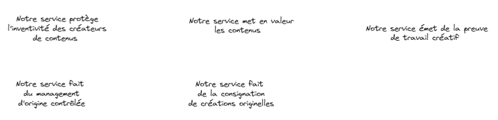

# CR - Réunion du Vendredi 22/07/2022
## **Présents :**
	- Olivier
	- Clément
	- Marwane

## **Déroulé de la réunion :** 
### Réflexions sur le nom de la DApp
+ Fructus
+ OriginPaper
+ GenesisPaper
+ StampOwn
+ Cellule Souche
+ Rang Zero
+ Originel
+ Origine Contrôlée Management  

### **Précision du concept de la DApp**
**Description 1 :** une application décentralisée permettant à un créateur de certifier qu'il est le propriétaire de son contenu.   

**Description 2 :** protocole d'indexation de produit (documents/œuvres) sur la blockchain, générant une certification horodatée au créateur du produit.  

**Description 3 :**  
- **Quoi ?** Un outil de preuve de création originelle.  
- **Pourquoi ?** Pour améliorer l'expérience des utilisateurs de contenus.  
- **Pour qui ?** Les créateur de contenus.  
- **Comment ?** En consignant sur la blockchain le hash d'un fichier
qui contient une création originelle.  
- **Combien ?** Générer 1% de l'équivalent des recettes de l'INPI soit 
2 millions d'euros.

## **Travail à réaliser pour Lundi 25/07/2022**
- Réflechir au fonctionnement que pourrait avoir la DApp.