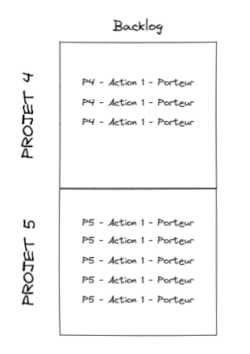

# CR - Réunion du Lundi 25/07/2022
## **Présents :**
	- Olivier
	- Clément
	- Marwane

## **Déroulé de la réunion :** 
### **Création d'une timeline et d'un backlog**
Rétroplanning et backlogs pour les projets 4 et 5 du 21/07 au 11/08 (voir [Dashboard](https://excalidraw.com/#json=8pfq_1t7HjHdDxkDh8QAq,tQOS3WNWfaooxqSvmwmLKw))  

**Extrait du rétroplanning :**  
  

**Backlog :**    

### **Précision du fonctionnement de la DApp**
Présentation du fonctionnement de la DApp par Olivier : [Dashboard -  R3](https://excalidraw.com/#json=8pfq_1t7HjHdDxkDh8QAq,tQOS3WNWfaooxqSvmwmLKw)

## **Travail à réaliser pour Lundi 25/07/2022**
- *None*